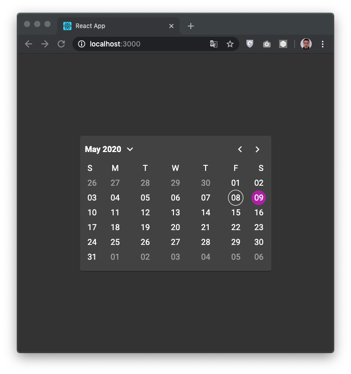

# Material Calendar

> Simple self-written material calendar without many count of third party dependencies created on React

Just React, TypeScript, Roboto font type and material icons. The layout is adaptive (grid, flexbox), calendar can easily be converted to a larger or smaller size.

